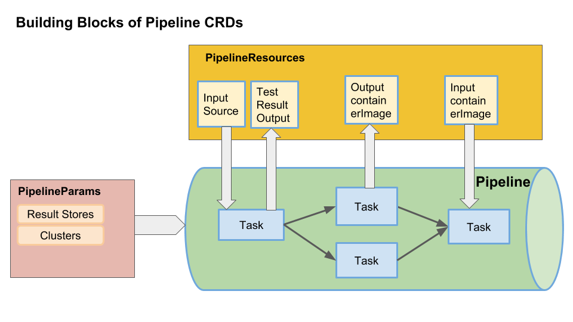

# Pipeline CRDs
Pipeline CRDs is an open source implementation to configure and run CI/CD style pipelines for your kubernetes application.

Pipeline CRDs creates [Custom Resources](https://kubernetes.io/docs/concepts/extend-kubernetes/api-extension/custom-resources/) as building blocks to declare pipelines. 

A custom resource is an extension of Kubernetes API which can create a custom [Kubernetest Object](https://kubernetes.io/docs/concepts/overview/working-with-objects/kubernetes-objects/#understanding-kubernetes-objects).
Once a custom resource is installed, users can create and access its objects with kubectl, just as they do for built-in resources like pods, deployments etc.
These resources run on-cluster and are implemeted by [Kubernetes Custom Resource Definition (CRD)](https://kubernetes.io/docs/concepts/extend-kubernetes/api-extension/custom-resources/#customresourcedefinitions).


# Building Blocks of Pipeline CRDs
Below diagram lists the main custom resources created by Pipeline CRDs



## Task
A Task is a collection of sequential steps you would want to run as part of your continous integration flow. 
A task will run inside a container on your cluster. A Task declares,
1. Inputs the task needs. 
1. Outputs the task will produce.
1. Sequence of steps to execute. 
   
   Each step defines an container image. This image is of type [Builder Image](https://github.com/knative/docs/blob/master/build/builder-contract.md). A Builder Image is an image whose entrypoint is a tool that performs some action and exits with a zero status on success. These entrypoints are often command-line tools, for example, git, docker, mvn, and so on.

Here is an example simple Task definition which echoes "hello world". The `hello-world` task does not define any inputs or outputs. 

It only has one step named `echo`. The step uses the builder image `busybox` whose entrypoint set to `\bin\sh`.

```shell
apiVersion: pipeline.knative.dev/v1alpha1
kind: Task
metadata:
  name: hello-world
  namespace: default
spec:
  buildSpec:
    steps:
      - name: echo
        image: busybox
        args:
          - echo  
          - "hello world!"
```
Examples of `Task` definitions with inputs and outputs are [here](./examples)

## Pipeline
`Pipeline` describes a graph of [Tasks](#Task) to execute.

Below, is a simple pipeline which runs `hello-world-task` twice one after the other.

In this `echo-hello-twice` pipeline, there are two named tasks; `hello-world-first` and `hello-world-again`.

Both the tasks, refer to [`Task`](#Task) `hello-world` mentioned in `taskRef` config.

```shell
apiVersion: pipeline.knative.dev/v1alpha1
kind: Pipeline
metadata:
  name: echo-hello-twice
  namespace: default
spec:
  tasks:
    - name: hello-world-first         
      taskRef:
        name: hello-world
    - name: hello-world-again         
      taskRef:
        name: hello-world
```
_TODO: Consider making `taskRef` more [concise](https://github.com/knative/build-pipeline/issues/138)_
_TODO: Consider specifying task dependency_

Examples of pipelines with complex DAGs are [here](./examples/pipelines)

## PipelineResources
`PipelinesResources` in a pipeline are the set of objects that are going to be used as inputs to a [`Task`](#Task) and can be output of [`Task`](#Task) .
For e.g.:
A task's input could be a github source which contains your application code. 
A task's output can be your application container image which can be then deployed in a cluster.
Read more on PipelineResources and their types [here](./docs/pipeline-resources.md)


## PipelineParams
_TODO add text here_


